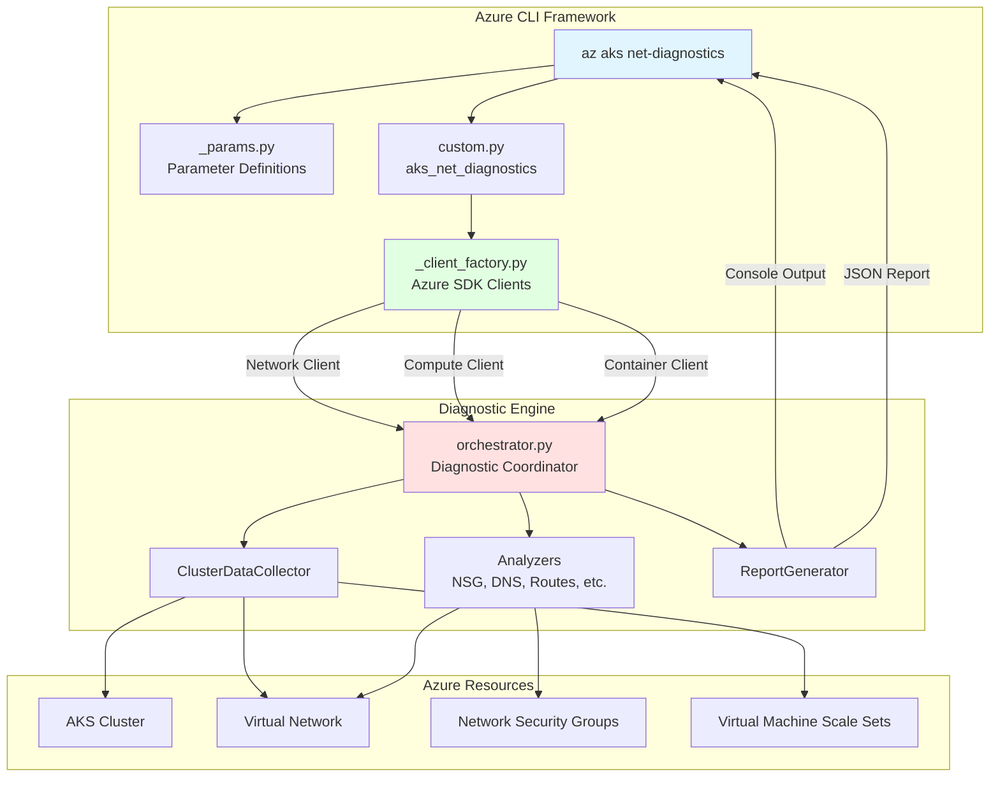
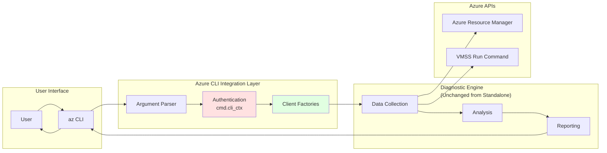
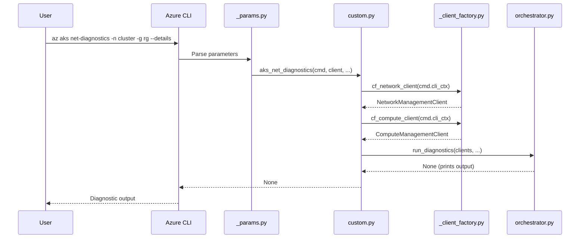
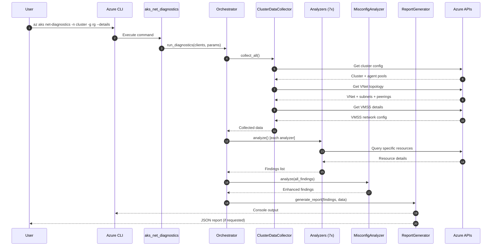
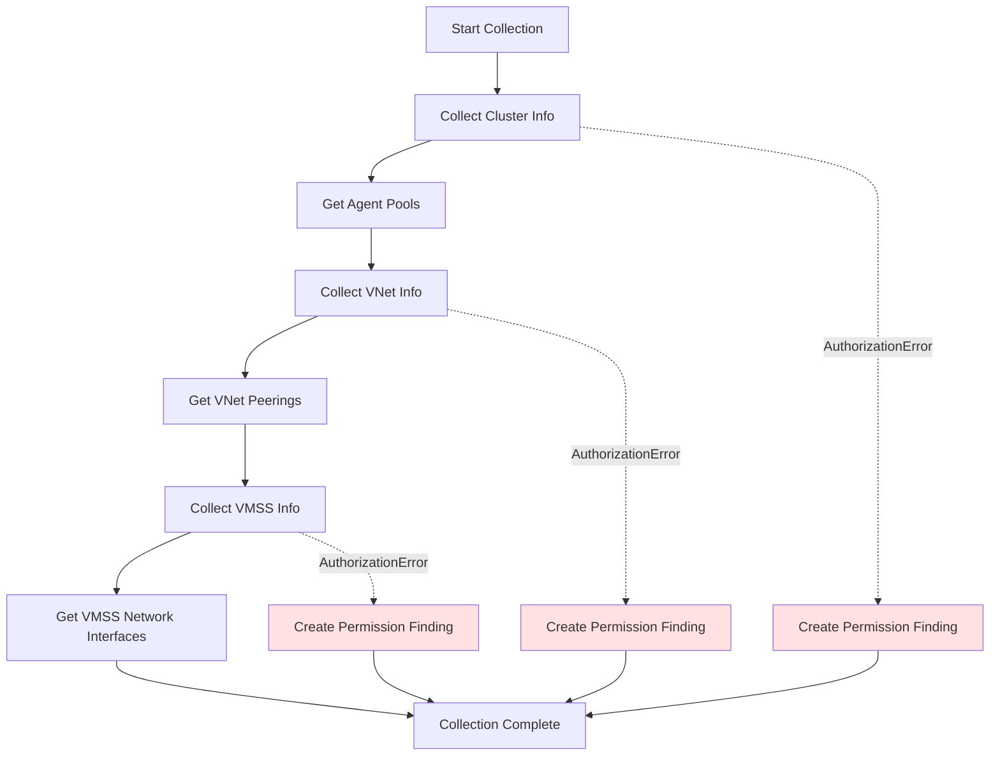
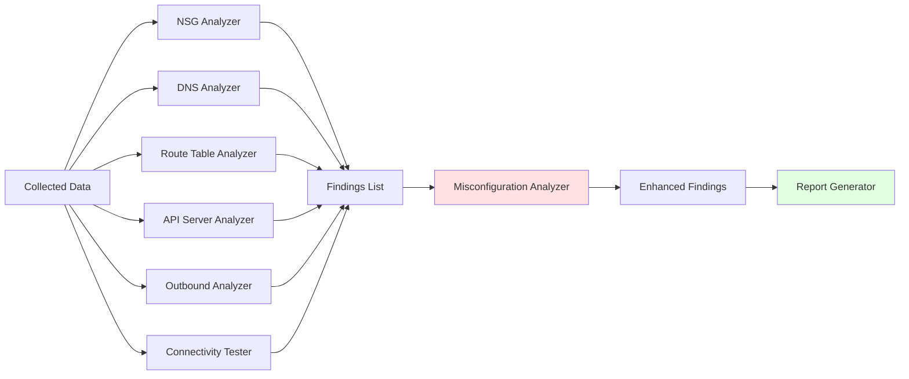
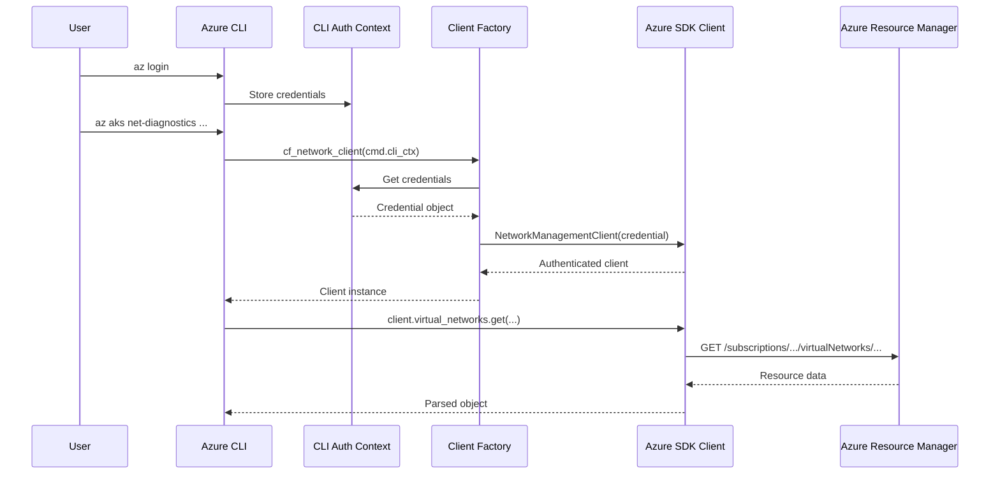
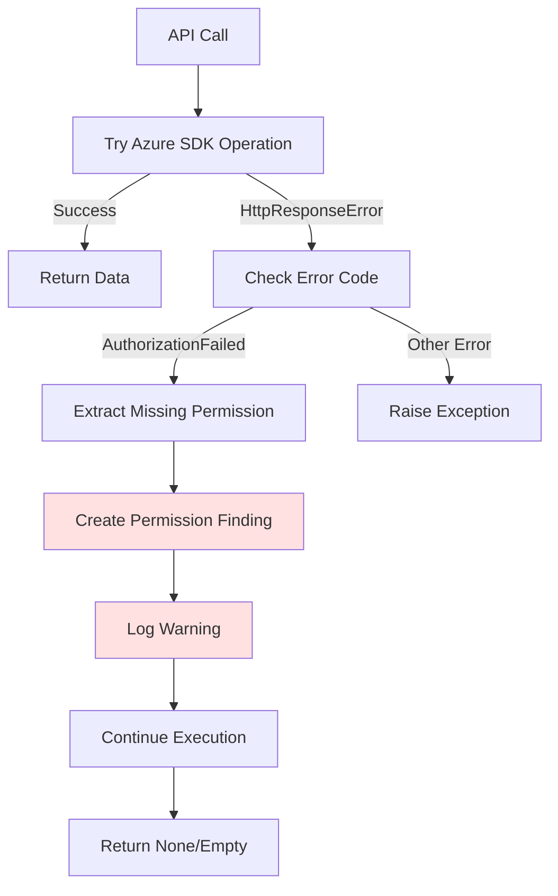

# Azure CLI AKS Net-Diagnostics Architecture

---

## Table of Contents

1. [POC Journey](#poc-journey)
2. [Architecture Overview](#architecture-overview)
3. [Integration Design](#integration-design)
4. [Module Breakdown](#module-breakdown)
5. [Data Flow](#data-flow)
6. [Authentication Architecture](#authentication-architecture)
7. [Design Decisions](#design-decisions)
8. [Code Quality Metrics](#code-quality-metrics)

---

## POC Journey

This Azure CLI integration represents **Stage 3 of a comprehensive proof-of-concept** to validate network diagnostics for AKS clusters.

### POC Stages

**Stage 1: Standalone Python Script**

- Initial diagnostic logic development
- Basic network analysis capabilities
- Simple authentication approach
- Validated diagnostic concepts

**Stage 2: Azure SDK Integration**

- Refactored to use Azure SDK for Python
- Proper Azure API integration patterns
- Enhanced authentication with DefaultAzureCredential
- Validated Azure SDK interaction patterns

**Stage 3: Azure CLI Integration** *(Current)*

- Native `az aks` subcommand implementation
- CLI-native authentication (cmd.cli_ctx)
- Follows Azure CLI conventions
- Complete POC ready for stakeholder review

**Goal**: The ultimate objective was always to provide this functionality as an `az aks` subcommand. The standalone versions were intermediate steps to validate the diagnostic logic and Azure integration patterns before committing to the full CLI integration.

---

## Architecture Overview

### Design Philosophy

The Azure CLI integration represents the **final phase of a multi-stage POC** that began with a standalone diagnostic tool and evolved through Azure SDK integration to reach this Azure CLI native implementation.

**Core Principles:**

1. **Iterative Development**: POC evolved from standalone script → Azure SDK version → CLI integration
2. **CLI-Native Authentication**: Leverage Azure CLI's authentication system
3. **Minimal Adaptation**: Change only what's necessary for CLI integration
4. **Consistent Behavior**: Maintain diagnostic capabilities across POC iterations
5. **Maintainability**: Clean separation between CLI adapter and diagnostic engine

---

### High-Level Architecture



---

### Integration Architecture Pattern



---

## Integration Design

### Command Registration Flow



---

### Key Integration Points

#### 1. Command Registration (`commands.py`)

```python
with self.command_group('aks', managed_clusters_sdk, 
                       client_factory=cf_managed_clusters) as g:
    g.custom_command('net-diagnostics', 'aks_net_diagnostics')
```

**Purpose**: Register the `net-diagnostics` subcommand under `az aks`

---

#### 2. Parameter Definitions (`_params.py`)

```python
with self.argument_context('aks net-diagnostics') as c:
    c.argument('name', options_list=['--name', '-n'], help='Cluster name')
    c.argument('resource_group_name', options_list=['--resource-group', '-g'])
    c.argument('details', action='store_true', help='Show detailed diagnostics')
    c.argument('probe_test', action='store_true', help='Run connectivity tests')
    c.argument('json_report', help='Path to save JSON report')
```

**Purpose**: Define CLI parameters (Azure CLI handles parsing, validation, help text)

---

#### 3. Command Handler (`custom.py`)

```python
def aks_net_diagnostics(cmd, client, resource_group_name, name, 
                       details=False, probe_test=False, json_report=None):
    # Get authenticated clients using CLI context
    network_client = cf_network_client(cmd.cli_ctx)
    compute_client = cf_compute_client(cmd.cli_ctx)
    
    # Get cluster info
    cluster = client.get(resource_group_name, name)
    subscription_id = get_subscription_id(cmd.cli_ctx)
    
    # Call diagnostic orchestrator
    run_diagnostics(
        aks_client=client,
        network_client=network_client,
        compute_client=compute_client,
        subscription_id=subscription_id,
        resource_group_name=resource_group_name,
        cluster_name=name,
        detailed=details,
        probe_connectivity=probe_test,
        json_report_path=json_report
    )
```

**Purpose**: Bridge Azure CLI framework to diagnostic engine

---

#### 4. Client Factories (`_client_factory.py`)

```python
def cf_network_client(cli_ctx, subscription_id=None):
    return get_mgmt_service_client(cli_ctx, 
                                   ResourceType.MGMT_NETWORK,
                                   subscription_id=subscription_id)

def cf_compute_client(cli_ctx, subscription_id=None):
    return get_mgmt_service_client(cli_ctx,
                                   ResourceType.MGMT_COMPUTE,
                                   subscription_id=subscription_id)
```

**Purpose**: Create authenticated Azure SDK clients using CLI's auth context

---

## Module Breakdown

### Directory Structure

```
src/azure-cli/azure/cli/command_modules/acs/
├── net_diagnostics/              # 🆕 Diagnostic engine (POC Phase 3: CLI Integration)
│   ├── __init__.py              # Module initialization
│   ├── orchestrator.py          # Main diagnostic coordinator (adapted)
│   ├── models.py                # Data models and finding codes
│   ├── exceptions.py            # Custom exception types
│   ├── validators.py            # Input validation
│   ├── _version.py              # Version info
│   ├── base_analyzer.py         # Base class for analyzers
│   ├── cluster_data_collector.py # Azure data gathering
│   ├── nsg_analyzer.py          # NSG analysis
│   ├── dns_analyzer.py          # DNS configuration analysis
│   ├── route_table_analyzer.py  # UDR impact analysis
│   ├── api_server_analyzer.py   # API server access analysis
│   ├── outbound_analyzer.py     # Outbound connectivity analysis
│   ├── connectivity_tester.py   # Active connectivity testing
│   ├── misconfiguration_analyzer.py # Cross-component correlation
│   └── report_generator.py      # Output formatting
├── commands.py                  # ✏️ Added net-diagnostics registration
├── _params.py                   # ✏️ Added parameter definitions
├── custom.py                    # ✏️ Added aks_net_diagnostics handler
└── _client_factory.py           # ✏️ Added network/compute client factories
```

**Legend:**
- 🆕 New directory/files (14 diagnostic modules)
- ✏️ Modified existing files (4 files, minimal changes)

---

### Core Modules (Diagnostic Engine)

All modules below were **adapted for CLI integration** during the final POC phase.

#### 1. Orchestrator (`orchestrator.py`)

**Purpose**: Coordinate the diagnostic workflow

**Key Adaptations for CLI**:
- ❌ Removed: `parse_arguments()` - CLI handles this
- ❌ Removed: `DefaultAzureCredential` initialization
- ✅ Changed: Accept pre-authenticated Azure SDK clients as parameters
- ✅ Changed: Accept parameters as function arguments instead of argparse

**Diagnostic Flow**:
```
1. Cluster Data Collection
2. VNet Analysis
3. Outbound Configuration Analysis  
4. VMSS Network Configuration
5. NSG Analysis
6. Private DNS Analysis
7. API Server Access Analysis
8. Connectivity Testing (optional with --probe-test)
9. Misconfiguration Correlation
10. Report Generation
```

---

#### 2. ClusterDataCollector (`cluster_data_collector.py`)

**Purpose**: Centralized data collection from Azure

**Adaptations for CLI**:
- ✅ Constructor accepts individual clients (aks, network, compute) instead of wrapper
- ✅ Uses `_to_dict()` helper for SDK object conversion
- ✅ Dict keys use snake_case (SDK native format)

**Key Methods**:
- `collect_cluster_info()` - Cluster and agent pool configuration
- `collect_vnet_info()` - VNet topology and peerings
- `collect_vmss_info()` - VMSS network configuration
- `_check_authorization_error()` - Permission error detection (Phase 7)

**Dependencies**: Azure SDK clients (NetworkManagementClient, ComputeManagementClient)

---

#### 3. Analysis Modules

All analyzers inherit common patterns from `BaseAnalyzer`:

##### NSGAnalyzer (`nsg_analyzer.py`)

**Purpose**: Network Security Group validation

**Analyzes**:
- Required AKS outbound rules (MCR, Azure Cloud, DNS, NTP)
- Inter-node communication rules
- Blocking rules and overrides
- Service tag semantics

**Key Finding Codes**:
- `NSG_INTER_NODE_BLOCKED` - Rules blocking node-to-node traffic
- `NSG_BLOCKING_AKS_TRAFFIC` - Rules blocking required AKS traffic
- `NSG_POTENTIAL_BLOCK` - Potentially problematic rules

---

##### DNSAnalyzer (`dns_analyzer.py`)

**Purpose**: DNS configuration validation

**Analyzes**:
- Azure default DNS vs custom DNS
- Private DNS zone configuration
- VNet links for private clusters
- Custom DNS server reachability

**Key Finding Codes**:
- `PRIVATE_DNS_MISCONFIGURED` - Custom DNS can't resolve private zones
- `PDNS_DNS_HOST_VNET_LINK_MISSING` - Missing VNet link

**Phase 7 Enhancement**: Added permission error handling for VNet retrieval

---

##### RouteTableAnalyzer (`route_table_analyzer.py`)

**Purpose**: User Defined Route (UDR) impact assessment

**Analyzes**:
- Default route (0.0.0.0/0) presence
- Next hop types (VirtualAppliance, VirtualNetworkGateway, Internet)
- Impact on AKS management traffic

**Key Finding Codes**:
- `ROUTE_DEFAULT_TO_FIREWALL` - UDR redirecting to firewall/NVA
- `ROUTE_OUTBOUND_OVERRIDE` - Routes affecting outbound connectivity

---

##### APIServerAccessAnalyzer (`api_server_analyzer.py`)

**Purpose**: API server network access security

**Analyzes**:
- Authorized IP ranges configuration
- Public vs private cluster setup
- UDR override detection (firewall/NVA routing)
- Outbound IP authorization validation

**Key Finding Codes**:
- `API_OUTBOUND_NOT_AUTHORIZED` - Cluster IPs not in authorized ranges
- `API_CLIENT_NOT_AUTHORIZED` - Current client can't access API

---

##### OutboundConnectivityAnalyzer (`outbound_analyzer.py`)

**Purpose**: Outbound configuration analysis

**Analyzes**:
- Outbound type (LoadBalancer, NAT Gateway, UDR)
- Public IP configuration
- NAT Gateway settings
- Load balancer outbound rules
- UDR impact on outbound traffic

**Key Finding Codes**:
- `OUTBOUND_MISCONFIGURED` - Invalid outbound configuration
- `OUTBOUND_NO_PUBLIC_IP` - Missing public IP for outbound

**Phase 7 Enhancement**: 
- Added permission error handling for LoadBalancer retrieval
- Fixed outbound IP display bug (showed resource ID instead of actual IP)

---

##### ConnectivityTester (`connectivity_tester.py`)

**Purpose**: Active connectivity testing from cluster nodes

**Tests**:
- MCR DNS resolution
- Internet HTTPS connectivity (MCR)
- API server DNS resolution
- API server HTTPS connectivity

**Features**:
- VMSS run-command execution
- Dependency-aware test execution
- Configurable timeouts
- Detailed error reporting

**Key Finding Codes**:
- `CONNECTIVITY_DNS_FAILURE` - DNS resolution failed
- `CONNECTIVITY_HTTP_FAILURE` - HTTPS connectivity failed

---

##### MisconfigurationAnalyzer (`misconfiguration_analyzer.py`)

**Purpose**: Correlate findings and detect complex issues

**Analyzes**:
- Cluster provisioning failures
- Node pool failures
- Connectivity test failures
- NSG compliance
- DNS misconfigurations

**Features**:
- Cross-component correlation
- Root cause analysis
- Actionable recommendations

**Phase 7 Enhancement**: Permission-aware analysis prevents false positives

---

#### 4. Reporting Module

##### ReportGenerator (`report_generator.py`)

**Purpose**: Format and output diagnostic reports

**Outputs**:
- Console summary report
- Detailed analysis report (--details flag)
- JSON structured export (--json-report flag)

**Features**:
- Markdown formatting
- Finding severity levels (CRITICAL, ERROR, WARNING, INFO)
- Network topology visualization
- NSG rule formatting
- Test result presentation
- Permission limitations section (Phase 7)

**Phase 7 Enhancements**:
- Contextual findings summary based on permission context
- Incomplete analysis indicators
- Fixed outbound IP display with permission checks
- Improved spacing and formatting consistency

---

### Utility Modules

#### Models (`models.py`)

**Purpose**: Data models and constants

**Contains**:
- `Finding` - Finding data structure with severity, code, message, recommendation
- `FindingCode` - Enumeration of all finding types
- `Severity` - Severity levels (INFO, WARNING, CRITICAL)
- `VMSSInstance` - VMSS instance model

**Phase 7 Addition**: New permission-specific finding codes:
- `PERMISSION_INSUFFICIENT_VNET`
- `PERMISSION_INSUFFICIENT_VMSS`
- `PERMISSION_INSUFFICIENT_LB`

---

#### Exceptions (`exceptions.py`)

**Purpose**: Custom exception types

**Defines**:
- `AKSDiagnosticsError` - Base exception
- `AzureSDKError` - Azure SDK API failures
- `AzureAuthenticationError` - Authentication failures
- `ClusterNotFoundError` - Cluster not found
- `InvalidConfigurationError` - Invalid cluster configuration
- `ValidationError` - Input validation failures

---

#### InputValidator (`validators.py`)

**Purpose**: Validate and sanitize user inputs

**Validates**:
- Cluster names and resource group names
- Subscription IDs (GUID format)
- Output file paths (prevent directory traversal)

**Features**:
- Pattern matching and length validation
- Path traversal prevention
- Safe filename sanitization

---

#### BaseAnalyzer (`base_analyzer.py`)

**Purpose**: Base class for all analyzers

**Provides**:
- Common initialization
- Finding management via `add_finding()` method
- Logger access
- Client dictionary access

**Adaptation**: Accepts `clients` dict instead of single `azure_sdk_client` wrapper

---

## Data Flow

### Complete Diagnostic Workflow



---

### Data Collection Phase Detail



---

### Analysis Phase Detail



---

## Authentication Architecture

### CLI Authentication Flow



---

### Permission Handling (Phase 7)



**Key Features:**
- Graceful degradation when permissions missing
- Actionable remediation commands in findings
- Prevents false positives in downstream analyzers
- Clear "Analysis Incomplete" indicators in reports

---

## Design Decisions

### 1. Iterative POC Approach

**Decision**: Develop POC in three stages: standalone → Azure SDK → Azure CLI integration

**Rationale**:
- ✅ Validate diagnostic logic independently first
- ✅ Iterate on Azure SDK integration before CLI constraints
- ✅ Reduce risk by testing concepts incrementally
- ✅ Learn authentication patterns before full CLI integration

**POC Stages**:
1. **Stage 1**: Standalone Python script with basic diagnostics
2. **Stage 2**: Azure SDK integration for proper Azure API interaction
3. **Stage 3**: Azure CLI integration (current implementation)

---

### 2. Output Format Preservation

**Decision**: Keep existing text output format (POC approach)

**Rationale**:

- ✅ Familiar output for POC validation
- ✅ Rich, readable console output with colors
- ✅ Effective for diagnostic use cases
- ✅ Faster POC delivery

**Future Enhancement** (post-POC if approved):

- Add structured output formats (--output json/table/yaml/tsv)
- Align with other `az aks` commands

---

### 3. Minimal CLI Integration

**Decision**: Change only 4 existing files, add diagnostic engine as new directory

**Modified Files**:
1. `commands.py` - 3 lines (command registration)
2. `_params.py` - 13 lines (parameter definitions)
3. `custom.py` - 73 lines (command handler)
4. `_client_factory.py` - 10 lines (client factories)

**Rationale**:
- ✅ Minimal impact on existing ACS module
- ✅ Easy to review and merge
- ✅ Low risk of breaking existing commands
- ✅ Clean separation of concerns

---

### 4. Authentication Adapter Pattern

**Decision**: Use CLI client factories instead of creating custom adapter class

**Rationale**:
- ✅ Follows Azure CLI conventions
- ✅ Reuses existing `get_mgmt_service_client()` infrastructure
- ✅ Consistent with other ACS commands
- ✅ Simpler code

**Implementation**:
```python
# Instead of creating AzureSDKClient wrapper class:
network_client = cf_network_client(cmd.cli_ctx)
compute_client = cf_compute_client(cmd.cli_ctx)

# Pass directly to orchestrator:
run_diagnostics(network_client=network_client, ...)
```

---

---

### 5. Permission Error Handling (Phase 7)

**Decision**: Detect authorization errors, create findings, continue execution

**Rationale**:

- ✅ Users often have limited permissions in POC testing
- ✅ Partial analysis better than complete failure
- ✅ Clear communication of limitations
- ✅ Actionable remediation guidance

**Pattern**:

```python
try:
    resource = client.some_api_call()
except HttpResponseError as e:
    if "AuthorizationFailed" in str(e):
        self._check_authorization_error(e, "context")
        return None  # Graceful degradation
    raise
```

---

## Code Quality Metrics

### Implementation Stats

| Metric | Value | Notes |
|--------|-------|-------|
| **Diagnostic Modules** | 14 files | POC diagnostic engine |
| **Total Lines Added** | ~6,500 lines | All diagnostic logic |
| **Modified Existing Files** | 4 files | Minimal CLI integration |
| **New Lines in Modified Files** | 99 lines | Command registration + handler |
| **Pylint Score** | 10.00/10 | Perfect rating maintained |
| **Flake8** | PASSED | Zero style violations |
| **Linter Checks** | PASSED | 0 violations (22 rules) |

---

### Testing Coverage

| Test Category | Status | Details |
|---------------|--------|---------|
| **Integration Tests** | ✅ COMPLETE | 36+ tests, 100% pass rate |
| **Network Types Tested** | 3/3 | Overlay, Kubenet, Pod Subnet |
| **Test Clusters Used** | 5 clusters | POC validation clusters |
| **Permission Scenarios** | ✅ TESTED | Full + limited permissions |
| **Bugs Found & Fixed** | 25 bugs | 100% resolution rate |

---

### Phase Completion Status

| Phase | Status | Time Spent | Key Deliverables |
|-------|--------|-----------|------------------|
| Phase 1: Planning | ✅ COMPLETE | ~5 hours | Architecture docs, task list |
| Phase 2: Dev Setup | ✅ COMPLETE | ~15 min | Environment configured |
| Phase 3: Auth Adapter | ✅ COMPLETE | ~3 hours | Client factories, command handler |
| Phase 4: Copy Modules | ✅ COMPLETE | ~8 hours | All 14 diagnostic modules |
| Phase 5: Command Registration | ✅ COMPLETE | ~1 hour | Command registered, params defined |
| Phase 6: Integration Testing | ✅ COMPLETE | ~5 hours | 36+ tests, 24 bugs fixed |
| Phase 7: UX & Permissions | ✅ COMPLETE | ~2.5 hours | Permission handling, 25 bugs fixed |
| **Phase 8: Enhancements** | 📋 DEFERRED | - | Pod CIDR + node pool display |
| **TOTAL (Phases 1-7)** | **✅ 100%** | **~28 hours** | **POC Ready** |

---

## Deployment & Usage

### Installation (Development)

```bash
# 1. Clone Azure CLI repository
git clone https://github.com/sturrent/azure-cli.git
cd azure-cli

# 2. Checkout integration branch
git checkout aks-net-diagnostics-integration

# 3. Install in editable mode
pip install -e src/azure-cli/

# 4. Verify installation
az aks net-diagnostics --help
```

---

### Usage Examples

```bash
# Basic diagnostics
az aks net-diagnostics -n myCluster -g myResourceGroup

# Detailed output
az aks net-diagnostics -n myCluster -g myResourceGroup --details

# With active connectivity tests
az aks net-diagnostics -n myCluster -g myResourceGroup --probe-test

# Export JSON report
az aks net-diagnostics -n myCluster -g myResourceGroup --json-report report.json

# All flags combined
az aks net-diagnostics -n myCluster -g myResourceGroup --details --probe-test --json-report report.json
```

---

### Sample Output

**Example 1: Cluster with no issues detected**

```
==========================================================================
# AKS Network Assessment Summary

**Cluster:** myCluster (Succeeded)
**Resource Group:** myResourceGroup
**Generated:** 2025-10-23 23:13:56 UTC

**Configuration:**
- Network Plugin: azure
- Outbound Type: loadBalancer
- Private Cluster: false

**Outbound Configuration:**
- Load Balancer IPs: 20.123.45.67

### Connectivity Tests
- **Status:** Skipped (Not requested)


**Findings Summary:**
[OK] No issues detected

Tip: Use --details flag for detailed analysis

[OK] AKS network assessment completed successfully!
```

**Example 2: Cluster with warnings (NSG rules)**

```
==========================================================================
# AKS Network Assessment Summary

**Cluster:** myCluster (Succeeded)
**Resource Group:** myResourceGroup
**Generated:** 2025-10-23 23:33:37 UTC

**Configuration:**
- Network Plugin: azure
- Outbound Type: loadBalancer
- Private Cluster: false

**Outbound Configuration:**
- Load Balancer IPs: 20.123.45.67

### Connectivity Tests
- **Status:** Skipped (Not requested)


**Findings Summary:**
- [WARNING] API server access: API server access restricted - API server has authorized IP ranges enabled with 1 configured range(s). Only traffic from these IPs can access the API server.
- [WARNING] NSG 'my-nsg' has rules that may block inter-node communication
- [WARNING] NSG rule 'DenyAllOutbound' in 'my-nsg' may block AKS traffic but is overridden

Tip: Use --details flag for detailed analysis

[OK] AKS network assessment completed successfully!
```

**Example 3: Private cluster with DNS configuration errors**

```
==========================================================================
# AKS Network Assessment Summary

**Cluster:** myPrivateCluster (Failed)
**Resource Group:** myResourceGroup
**Generated:** 2025-10-23 23:34:14 UTC

**Configuration:**
- Network Plugin: azure
- Outbound Type: loadBalancer
- Private Cluster: true

**Outbound Configuration:**
- Load Balancer IPs: 20.234.56.78

### Connectivity Tests
- **Status:** Skipped (Not requested)


**Findings Summary:**
- [CRITICAL] Cluster failed with error: VMExtensionProvisioningError
- [CRITICAL] Node pools in failed state: nodepool1
- [WARNING] Private cluster is using custom DNS servers (10.1.0.10) which may not resolve Azure private DNS zones

Tip: Use --details flag for detailed analysis

[OK] AKS network assessment completed successfully!
```

**Example 4: Detailed output with --details flag**

```
==========================================================================
# AKS Network Assessment Report

**Cluster:** myPrivateCluster
**Resource Group:** myResourceGroup
**Subscription:** xxxxxxxx-xxxx-xxxx-xxxx-xxxxxxxxxxxx
**Generated:** 2025-10-24 00:28:25 UTC

## Cluster Overview

| Property | Value |
|----------|-------|
| Provisioning State | Failed |
| Power State | Running |
| Location | canadacentral |
| Network Plugin | azure |
| Outbound Type | loadBalancer |
| Private Cluster | true |

## Network Configuration

### Service Network
- **Service CIDR:** 10.0.0.0/16
- **DNS Service IP:** 10.0.0.10
- **Pod CIDR:** 

### API Server Access
- **Type:** Private cluster
- **Private FQDN:** myPrivateCluster-xxxxxxxx.yyyyyyyy-yyyy-yyyy-yyyy-yyyyyyyyyyyy.privatelink.canadacentral.azmk8s.io
- **Private DNS Zone:** system
- **Access Restrictions:** None (unrestricted public access)

### Outbound Connectivity
- **Type:** loadBalancer
- **Effective Public IPs:**
  - 20.234.56.78

### User Defined Routes Analysis
- **No route tables found on node subnets**


### Connectivity Tests
- **Status:** Skipped (Not requested)

### Network Security Group (NSG) Analysis
- **NSGs Analyzed:** 2
- **Issues Found:** 0
- **Inter-node Communication:** [OK] Not blocked

**Subnet NSGs:**
- **aks-subnet** -> NSG: myCluster-subnet-nsg
  - Custom Rules: 0, Default Rules: 6

**NIC NSGs:**
- **aks-agentpool-nsg** (used by: aks-nodepool1-vmss)
  - Custom Rules: 0, Default Rules: 6

## Findings

**Findings Summary:**
- [CRITICAL] 3
- [WARNING] 1

### [CRITICAL] CLUSTER_OPERATION_FAILURE
**Message:** Cluster failed with error: VMExtensionProvisioningError: CSE failed with 'VMExtensionError_K8SAPIServerDNSLookupFail', which means agents are unable to resolve Kubernetes API server name. It's likely custom DNS server is not correctly configured, please see https://aka.ms/aks/vmextensionerror_k8sapiserverdnslookupfail and https://aka.ms/aks/private-cluster#hub-and-spoke-with-custom-dns for more information.
**Recommendation:** Check Azure Activity Log for detailed failure information and contact Azure support if needed

### [CRITICAL] NODE_POOL_FAILURE
**Message:** Node pools in failed state: nodepool1
**Recommendation:** Check node pool configuration and Azure Activity Log for detailed failure information

### [CRITICAL] PDNS_DNS_HOST_VNET_LINK_MISSING
**Message:** DNS server 10.1.0.10 is hosted in VNet customDnsVnet but this VNet is not linked to private DNS zone yyyyyyyy-yyyy-yyyy-yyyy-yyyyyyyyyyyy.privatelink.canadacentral.azmk8s.io. Cluster VNet myClusterVnet uses this DNS server.
**Recommendation:** Link VNet customDnsVnet to private DNS zone yyyyyyyy-yyyy-yyyy-yyyy-yyyyyyyyyyyy.privatelink.canadacentral.azmk8s.io to ensure proper DNS resolution for the private cluster

### [WARNING] PRIVATE_DNS_MISCONFIGURED
**Message:** Private cluster is using custom DNS servers (10.1.0.10) which may not resolve Azure private DNS zones
**Recommendation:** For private clusters, custom DNS servers must be configured to resolve Azure private DNS zones. Current DNS servers: 10.1.0.10. Ensure one of the following: (1) DNS server VNet is linked to the private DNS zone, OR (2) Configure DNS forwarding to Azure DNS (168.63.129.16) for '*.privatelink.*.azmk8s.io', OR (3) Use Azure DNS (168.63.129.16) as primary DNS server.

[OK] AKS network assessment completed successfully!
```

---

## Future Enhancements

### Phase 8: Node Pool Display & Pod CIDR Enhancement (Deferred)

**Scope:**

1. Enhanced pod CIDR detection for Azure CNI Pod Subnet variant
2. Detailed node pool information in --details output
3. Support for all 4 Azure CNI networking modes

**Status**: Comprehensive design document created, implementation deferred pending POC approval

---

### Post-POC Improvements (If POC is Approved)

1. **Structured Output Formats**
   - Add `--output json/table/yaml/tsv` support
   - Align with other `az aks` commands

2. **Automated Unit Tests**
   - Create mock-based unit tests
   - Add to Azure CLI test suite
   - Current POC: Integration testing with live clusters

3. **Cross-Subscription Resource Support**
   - Explicit testing with resources in different subscriptions
   - Foundation code already supports this (bugs #5-6 fixed)

4. **Performance Optimizations**
   - Parallel API queries (VNet, VMSS, NSG)
   - Caching for repeated operations

5. **Production Hardening**
   - Comprehensive error handling review
   - Edge case validation
   - User feedback integration

---

## Appendix

### Related Documentation

- **[Planning Documents](./planning/)** - Strategy and task tracking
- **[Progress Reports](./progress/)** - Phase completion details
- **[Development Setup](./guides/DEVELOPMENT-SETUP.md)** - Environment configuration
- **[POC Standalone Version](https://github.com/sturrent/aks-net-diagnostics/blob/azure-sdk/docs/ARCHITECTURE.md)** - POC Stage 2 (Azure SDK version)

---

**Last Updated**: October 23, 2025  
**Document Version**: 1.0.0
